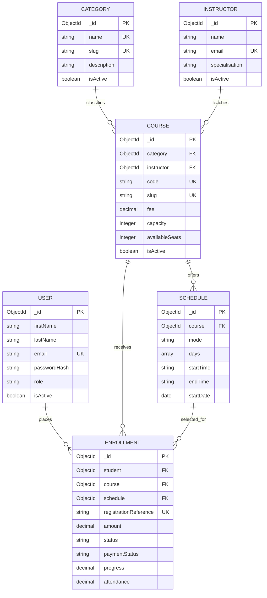

# LearnSphere database design and justification

## Design objective

The database must support course discovery, linked catalogue information, authenticated students, server-side registration, timetable selection, seat reduction, learner progress and administrator management. MongoDB is used through Mongoose because the assessment requires the principal MERN technologies.

## Entity-relationship view

`CONTACTMESSAGE` is intentionally independent because a visitor can submit an enquiry before an account exists. Runtime session documents are managed by `connect-mongo`; the course basket is held inside the user's server-side session.

## Relationship justification

- **Category 1 → many Courses:** a reusable category avoids repeating category descriptions and images in every course.
- **Instructor 1 → many Courses:** instructor profiles are managed once and referenced by courses.
- **Course 1 → many Schedules:** the model permits multiple delivery choices without duplicating the course record.
- **User 1 → many Enrollments:** registrations belong to the authenticated student and power the learner dashboard.
- **Course/Schedule 1 → many Enrollments:** each enrolment records exactly which course and timetable the student selected.
- **Enrollment as an associative collection:** it resolves the many-to-many relationship between students and courses and stores registration-specific facts such as amount, status, progress and attendance.

## Primary keys, references and constraints

- Every collection uses MongoDB `_id` as its primary key.
- Reference fields use `ObjectId` and Mongoose `ref` definitions.
- `users.email`, `categories.name`, `categories.slug`, `instructors.email`, `courses.code`, `courses.slug`, `enrollments.registrationReference` are unique.
- A compound unique index on `{ student, course }` prevents duplicate registration.
- A compound unique index on `{ course, startDate, mode }` prevents accidental duplicate schedules.
- Numeric validation prevents negative fees, seats, progress and attendance.
- Cross-field service validation prevents `availableSeats` exceeding `capacity`.
- The service layer verifies that selected categories, instructors, courses and schedules exist and are active before writes are accepted.
- Deactivation is used instead of destructive deletion so historic enrolment references remain valid.

## Data integrity during registration

Checkout follows this order:

1. Confirm an authenticated user.
2. Confirm the basket is not empty.
3. Confirm every basket item has a valid schedule belonging to its course.
4. Reject courses already registered by the same student.
5. Reduce `availableSeats` with an atomic conditional update requiring at least one seat.
6. Create the enrolment with the current database fee.
7. If any item fails, remove newly created enrolments and restore every seat already reduced.
8. Clear the session basket only after all enrolments succeed.

This prevents negative seat counts, duplicate enrolments and most partial-write failures without relying on a MongoDB replica-set transaction. Administrator status changes apply the inverse seat update when an enrolment is cancelled or restored, and course edits cannot advertise more seats than remain after seat-holding enrolments.

## Optimisation

- Indexes cover email login, course slug/code, active/featured course filtering, category/level/fee filtering, schedule dates, enrollment user/course lookups and status analytics.
- List endpoints apply pagination and a maximum page size.
- `populate()` selects only fields needed by list views where appropriate.
- Admin analytics use MongoDB aggregation for revenue, status totals and popular courses.
- Passwords are excluded from normal queries and JSON responses.

## Assumptions

1. One seat is reserved per student per course.
2. A student cannot enrol in the same course twice, even with a different schedule.
3. Course capacity is controlled by an administrator; confirmation reduces available seats by one.
4. The database fee at confirmation is authoritative; the public fee calculator is illustrative.
5. Payment is simulated for coursework purposes and no real card data is collected.
6. Existing enrolment history must remain readable when a course is deactivated.
7. Only administrators can change catalogue, schedule, enrolment or contact-message workflow records.
8. Progress and attendance are demonstration fields updated by an administrator.
9. Contact enquiries may be submitted without an account.
10. Dates and prices are displayed using UK conventions and GBP.
